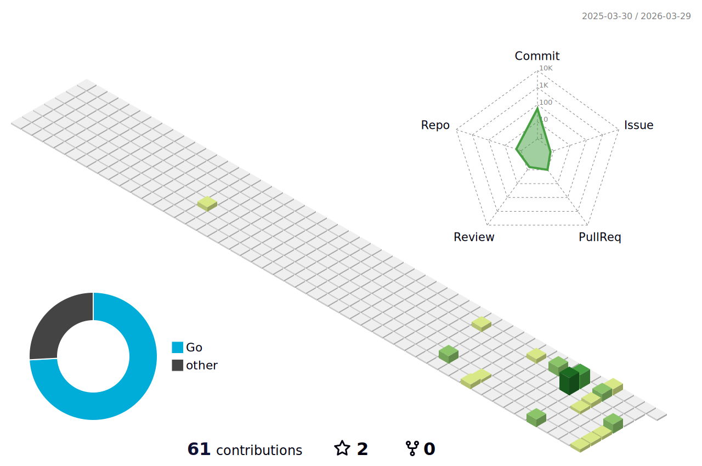

 
  

  

  
  

 
  

<h1 align="center">
  Hi!
  
</h1>

  

  ### :man_technologist: About Me:
  
- :telescope: I'am studying some development.

- :seedling: I plan to be a senior.

- :zap: In my free time I do sports and spend time with my family.

- :mailbox:How to reach me:   

  ### :hammer_and_wrench: Languages and Tools :

  &nbsp;  
  &nbsp;
  &nbsp;
  &nbsp;   

  ### :fire: My Stats:

<!-- Полоса коммитов (частота) -->

<!-- Небольшой график активности за год (опционально) -->

  :neckbeard: Quotes:

